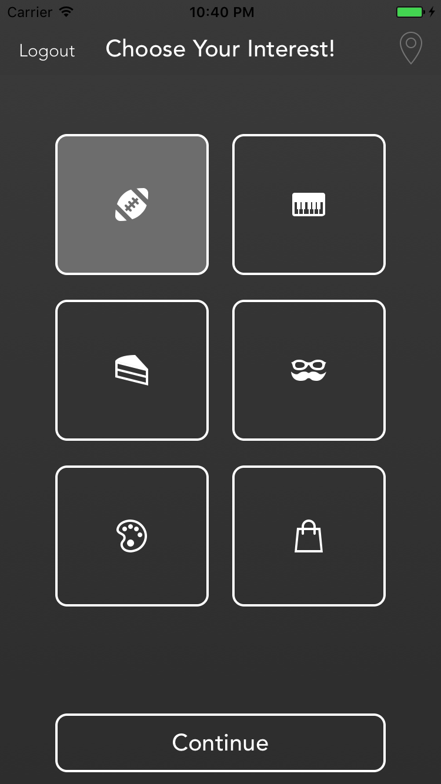
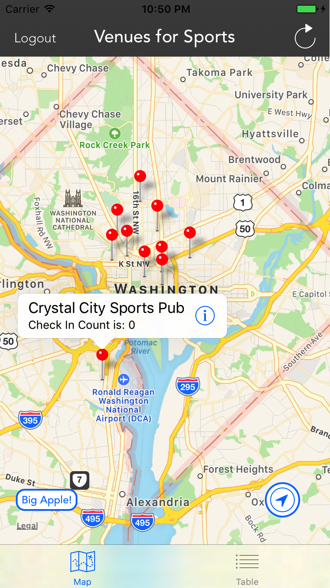
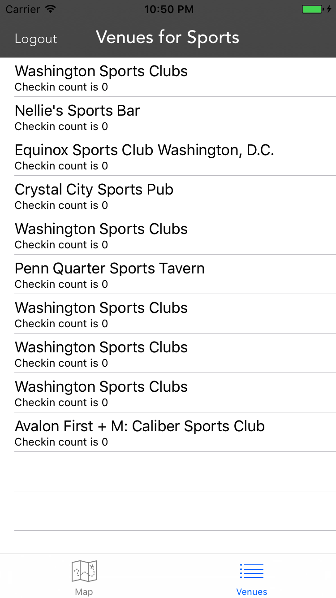
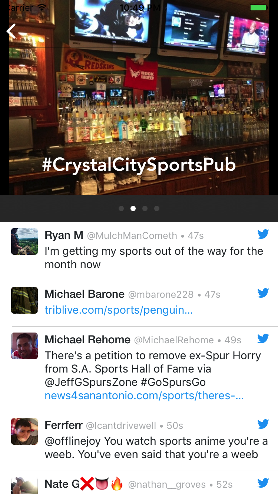

# Bop

This repository contains the source code for **Bop**, an iOS application written in Swift built with [Fabric](https://get.fabric.io) and [Foursquare](https://foursquare.com).

**Bop** is a fun way to search [Foursquare](https://foursquare.com) venues with a particular interest theme. Start by choosing from interest categories including "Sports", "Music", "Food", "Art", "Fashion" and "Culture." Browse [Twitter](https://twitter.com) updates and photos for specific venues in a detail view.

## Fabric

**Bop** uses many of the features available in [Fabric](https://get.fabric.io), including Crashlytics, Answers, Sign In with Twitter and Phone Number via Digits, and embedded Timelines with the TwitterKit.

## Foursquare

**Bop** uses the [Fousquare API](https://developer.foursquare.com/) to search for venues using an interest keyword and geographic location. Photos are downloaded using the venue's unique "ID" parameter from [Foursquare](https://foursquare.com).  

## Compatibiity

This project is written in Swift **3**. Please have the **latest version** of Xcode (version 8) installed prior to running. **Bop** is compatible with iPhones running iOS 8+ 

## Getting Started

To get started and run the app, you need to follow these steps:  
1. Fork the [official repository](https://github.com/tbajis/Bop).
2. Open the **Bop** project in Xcode
3. Sign up/Register for Fabric on [fabric.io](https://get.fabric.io) and [Foursquare](https://foursquare.com/developers/register).
4. Download and install the Fabric Mac App.
5. Sign in with your Fabric account, select the **Bop** Xcode project and choose organization.
6. Install Crashlytics, Digits, and Twitter Kits from the Mac app.
7. Run **Bop** on your iPhone or the iOS Simulator.

### Acquire a Foursquare Client ID and Secret Key

When you [register with Foursquare](https://foursquare.com/developers/register) be sure to secure a Client ID and Secret Key.

When you've secured Client ID and Secret Key, perform the following instructions: 

* Open the **Bop** project file in Xcode
* In the project navigator, find the **FoursquareConstants.swift** file
* Enter your Foursquare Client ID and Secret in the appropriate fields:

	```
	static let ClientId = "YOUR CLIENT ID HERE"
	static let ClientSecret = YOUR CLIENT SECRET HERE"
	```

## Usage

<p align="center">
	<figure></figure>
</p>

This app has four view controller scenes (shown left to right above)
1. **Login View**
2. **Interest Picker View**
3. **Map and Table Tab View**
4. **Detail View**

These three scenes are described in detail below.

### Login View

The **Login View** is presented to the user with three options for logging into **Bop**. The user may login by using their Twitter credentials or phone number. Optionally, the user may also login as a guest by pressing the **Continue as Guest** button. After logging in, the user will segue to the **Interest Picker View**  

### Interest Picker View

<p align="center">
	<figure></figure>
</p>

When the **Interest Picker View** loads, the user will be prompted to choose from one of six different "Interest" categories. The six categories to choose from are "Sports", "Music", "Food", "Art", "Fashion" and "Culture." When the user selects an interest, a **Continue** button will appear at the bottom of the view as shown above. Pressing the **Continue** button will segue the user to the **Map and Table Tab View**. Note that once an interest is selected, **Bop** will save that selected interest.

Note that if the user has already searched and persisted venues previously, the **Pin** button in the top navigation item will be illuminated and enabled. Pressing this button will allow the user to segue to the **Map and Table Tab View** and view their saved venues. 

At any time, the user may press the **Logout** button in the top navigation item. This will cancel any previously started session with Twitter or Digits and return the user to the **Login View**.   

### Venue Map and Table View

#### Map View

 

The **Map View** is the first view controller scene shown when the tab bar controller is loaded. The user will be prompted to allow **Bop** to access their location and a map will load and search for venues in the New York area like shown above. At this point, the user can search for venues from Foursquare based on their selected interest. This can be done in one of three ways:

1. By pressing the **Location Marker** button (lower right corner)
2. By pressing the **Big Apple!** button (lower left corner)
3. By pressing the **Refresh** button (top navigation item)

When the user selects any of the buttons mentioned above, **Bop** will search for venues, querying the user's selected "Interest" category. In addition, **Bop** will query a specific geographic coordinate with the search to return venues near a location. **Bop** will then save these venues for future use. The coordinate used for each search is broken down below.

 | Search Button | Coordinate Searched
 | ------------- | ---------------------------------- |
 | Location Marker | Current Location
 | Big Apple | (lat = 40.7, lng = -74) (New York City)
 | Refresh | MapView's current center

Note that when the **Location Marker** is selected, **Bop** will query the user's current location in the search. If the user did not previously authorize **Bop** to use their location, a search error will occur.

**Bop** will place the venues returned from the search request onto the map as pins. By tapping a pin, a callout will be presented that shows the venue's name and "Foursquare Check in Count". Pressing the callout accessory (i), the user will be segued to the **Detail View**.

At any time, the user may press the **Logout** button in the top navigation item. This will cancel any previously started session with Twitter or Digits and return the user to the **Login View**. 

#### Table View



The **Table View** is the second view controller scene shown when the Table tab is selected. The table will show all of the venues returned by the Foursquare search request. The venue's name and "Fousquare Check in Count" will be shown. By tapping on a venue in the table, the user will be segued to the **Detail View**. 

At any time, the user may press the **Logout** button in the top navigation item. This will cancel any previously started session with Twitter or Digits and return the user to the **Login View**.    

### Venue Detail View



The **Detail View** displays photos of the venue the user selected from the **Map View** or **Table View** scenes. Additionally, a Twitter feed is embedded in the bottom half of the view to provide the user with Twitter Timeline posts associated with their chosen interest.

If no internet connection can be established at the time of loading the view, a message, "Sorry, there are no recent Tweets to display." will appear in place of the Twitter feed.

## Contributing

I'd love to get pull requests from everyone. Here are some ways _you_ can contribute:

* by reporting bugs
* by suggesting new features
* by writing or editing documentation
* by writing specifications
* by writing code(ie. fix typos, add comments, clean up inconsistent white space)
* by creating more detailed, eye-pleasing design elements

### Submitting a Pull Request

1. [Fork](https://help.github.com/articles/fork-a-repo/) the [official repository.](https://github.com/tbajis/Bop)
2. [Create a topic branch.](https://help.github.com/articles/creating-and-deleting-branches-within-your-repository/)
3. Implement your feature or bug fix.
4. Add, commit, and push your changes. Please try to use the [Udacity Git Commit Message Style Guide.](http://udacity.github.io/git-styleguide/)
5. [Submit a pull request.](https://help.github.com/articles/about-pull-requests/)

## Notes

* Please add tests if you change the code.
* If you don't know how to add a test, please put in a PR and leave a comment asking for help. I'd love to help!

## License

Copyright 2017 Thomas Bajis.  

Licensed under the [Apache License, Version 2.0:](http://www.apache.org/licenses/LICENSE-2.0).
